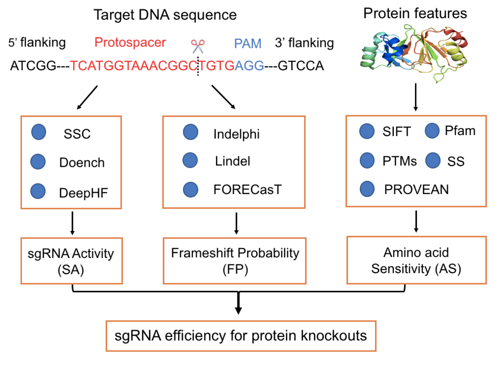

# GuidePro:A multi-source ensemble predictor for prioritizing sgRNAs in CRISPR/Cas9 protein knockouts

GuidePro is a two-layer ensemble predictor that enables the integration of multiple predictive methods and feature sets to predict sgRNA efficiency for the CRISPR/Cas9 protein knockouts. It integrates three sub-predictors trained with different types of features that jointly contribute to protein knockouts:i) The first predictor (SA) predicts sgRNA activity combining the outputs of other predictive methods. ii) The second predictor (FP) predicts the frameshift probabilities leveraging the predictions of three different models. iii) The third predictor (AS) predicts the amino acid sensitivity to the knockouts from annotation of protein features(see Figure below). To facilitate the users in selecting optimal sgRNAs for efficient protein knockout, GuidePro is implemented in a web application that includes exome-wide prediction in human, monkey and mouse genome, available <a href="http://smvxu.mdanderson.org:4949/GuidePro/." target="_blank">here<i class="fas fa-external-link-square-alt"></i></a>

[Model_Training.ipynb](https://github.com/MDhewei/GuidePro/blob/master/Model_Training.ipynb): The source codes to reproduce all the results for model training part including feature importance, cross-validation, model training and comparison.

[Model_Testing.ipynb](https://github.com/MDhewei/GuidePro/blob/master/Model_Testing.ipynb): The source codes to reproduce the results about performance comparison between our method and other programs on dependent and independent datasets

Contacts for any questions or requests: 
whe3@mdanderson.org

